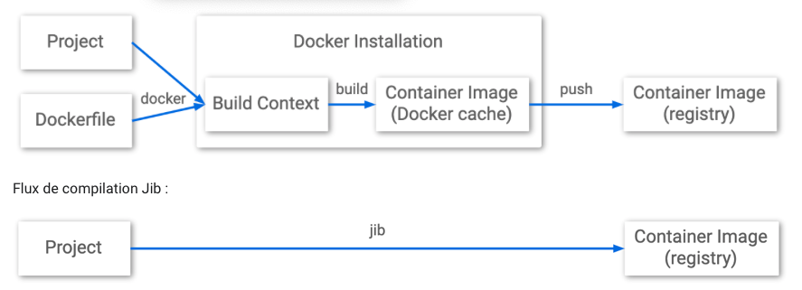

# Hello Jib demo

## Qu'est-ce que Docker ? 

Docker permet d'embarquer une application dans un ou plusieurs containers logiciels qui pourra s'exécuter sur n'importe quel serveur machine, qu'il soit physique ou virtuel. 
Docker fonctionne sous Linux comme Windows Server. C'est une technologie qui a pour but de faciliter les déploiements d'application, et la gestion du dimensionnement de l'infrastructure sous-jacente. Elle est proposée par la société Docker, en partie en open source (sous licence Apache 2.0).

## Quelle différence avec la virtualisation ? 

La virtualisation permet, via un hyperviseur, de simuler une ou plusieurs machines physiques, et les exécuter sous forme de machines virtuelles (VM) sur un serveur ou un terminal. Ces VM intègrent elles-mêmes un OS sur lequel des applications sont exécutées. Ce n'est pas le cas du container logiciel. Le container fait en effet directement appel à l'OS de sa machine hôte pour réaliser ses appels système et exécuter ses applications, d'où son extrême légèreté. Dans le cas de Linux, les containers Docker exploitent un composant du noyau Linux baptisé LXC (ou Linux Container). Au format Windows Server, ils s'adossent à une brique équivalente, appelée Windows Server Container. Le moteur Docker normalise ces briques par le biais d'API dans l'optique d'exécuter les applications dans des containers standards, qui sont ensuite portables d'un serveur à l'autre. 

## Dockerfile

Un conteneur se créé via des fichiers Dockerfile plus ou moins complexes. Le daemon docker est alors obligatoire pour générer des images à partir de ces fichiers et également pour exécuter ces "images".

Ex :

* Ubuntu 20.04 de base avec quelques outils : https://github.com/jeromeklam/u20
* Une extension de l'image précédente avec l'ajout de l'open JDK 11 : https://github.com/jeromeklam/u20_java11
* Et avec Tomcat 9 en plus : https://github.com/jeromeklam/u20_tomcat9

## Jib

Jib crée des conteneurs sans utiliser de fichier Dockerfile et ne nécessite pas l'installation de Docker.
Vous pouvez utiliser Jib dans les plug-ins Jib pour Maven ou Gradle, ou utiliser la bibliothèque Java Jib.



## Test on local env

Dans un dossier cloner le repo :

```
git clone https://github.com/jeromeklam/hello_jib .
```

Et puis on lance la compilation
```
mvn spring-boot:run
```

Puis se rendre à l'url :

```
http://localhost:8080/hello
```

## Build local

```
mvn compile jib:buildTar
```

Image dans le dossier target

## Build  grc.io

* Need google clound account

...

## build docker.io

```
mvn compile jib:build
```

* Nécessite un compte docker (docker hub)

```
mvn compile jib:dockerBuild
```

## Liens

* https://cloud.google.com/java/getting-started/jib